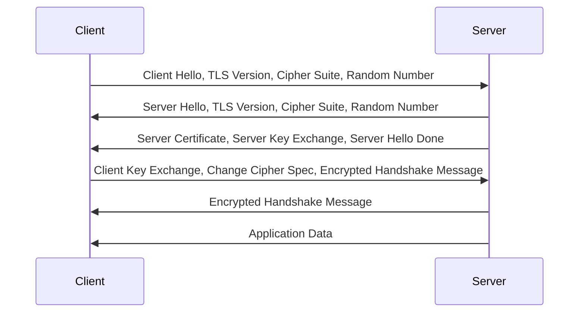

## Layer


### Application Layer 

BGP DHCP(v6) DNS FTP HTTP HTTPS IMAP IRC LDAP MGCP MQTT NNTP NTP OSPF POP PTP ONC/RPC RTP RTSP RIP SIP SMTP SNMP SSH Telnet TLS/SSL(HTTPS)

### Presentation Layer 

MIME

### Session Layer 

PPTP

### Transport Layer 

TCP: (Three way handshake, four way handshake) UDP DCCP SCTP RSVP QUIC

### Network Layer

IP IPv4 IPv6 ICMP ICMPv6 ECN IGMP OSPF IPsec RIP

### Data Link Layer

Tunnels PPP MAC

### Physical Layer

IEEE 802.11(a, b, g, n, ac, ax)

## CA, Https, Symmetric-key algorithm, Public-key cryptography (Application Layer)

* [非对称加密、对称加密、签名、CA机构、证书、https - bilibili](https://www.bilibili.com/video/BV1TP411G7wb)
* [HTTP是什么？- bilibili](https://www.bilibili.com/video/BV1zb4y127JU/?share_source=copy_web&vd_source=bf4952280cde801b178268abc99a7047)

### Public-key cryptography

Public Key - Public Key Encryption

Private Key - Private Key Decryption

Certificate Authority (CA) Sign on the public key with its private key

### TLS over TCP

[加密原理和证书。SSL/TLS握手过程](https://www.bilibili.com/video/BV1KY411x7Jp)

在传统的TCP三次握手过程中，不涉及TLS（Transport Layer Security）加密。三次握手是建立TCP连接的过程，用于在客户端和服务器之间建立可靠的数据传输通道。

然而，如果在TCP连接建立后，应用程序需要进行安全的数据传输，就可以在TCP连接的基础上使用TLS来实现加密。TLS是一种加密协议，用于在网络通信中保护数据的安全性和完整性。

在TLS加密流程中，大致可以分为以下几个步骤：

* 客户端发送ClientHello：客户端向服务器发送ClientHello消息，包含了支持的加密套件列表和随机数等信息。
* 服务器发送ServerHello：服务器从客户端发送的加密套件列表中选择一个加密套件，并向客户端发送ServerHello消息，包含了服务器选择的加密套件和随机数等信息。
* 客户端和服务器交换密钥：客户端根据服务器发送的信息生成会话密钥，并将其加密后发送给服务器。服务器接收到客户端发送的密钥后，使用私钥解密得到会话密钥。
* 加密数据传输：建立了安全的会话密钥后，客户端和服务器之间的数据传输都会使用该密钥进行加密和解密，确保数据在传输过程中的安全性。
* 完成握手：最后，客户端和服务器交换Finished消息，以确认握手过程完成，双方可以开始进行加密数据传输。

值得注意的是，TLS加密过程发生在TCP连接建立完成后。因此，在TCP三次握手阶段，还没有进行TLS加密。TLS加密是在建立了可靠的TCP连接后进行的，用于保障后续数据传输的安全。



## TCP Three-way handshake, four-way handshake Termination (Transport Layer)

[bilibili - TCP三次握手和四次挥手](https://www.bilibili.com/video/BV18h41187Ep/?share_source=copy_web&vd_source=bf4952280cde801b178268abc99a7047)

```
Client SYN 8633
Server SYN 303 ACK 8634
Server 8634 ACK 304

Client FIN ACK
Server ACK
Server FIN ACK
Client ACK
```

三次握手和四次挥手是TCP协议中建立和断开连接的过程。

三次握手（Three-Way Handshake）：

客户端发送连接请求（SYN：Synchronize）给服务器，表示客户端要建立连接。
服务器收到连接请求后，回复一个确认连接请求（SYN-ACK：Synchronize-Acknowledge）给客户端。
客户端收到服务器的确认连接请求后，再回复一个确认连接请求（ACK：Acknowledge）给服务器。
这样，建立连接的过程就完成了，双方都确认对方能够收发数据，可以开始传输数据。

四次挥手（Four-Way Handshake）：

客户端发送断开连接请求（FIN：Finish）给服务器，表示客户端要断开连接。
服务器收到断开连接请求后，回复一个确认断开连接请求（ACK）给客户端，表示服务器已经收到了断开请求。
服务器检查是否还有未传输完的数据，如果有，先传输完数据再发送一个断开连接请求（FIN）给客户端，表示服务器也准备好断开连接了。
客户端收到服务器的断开连接请求后，回复一个确认断开连接请求（ACK）给服务器，表示客户端已经收到了断开请求。
这样，断开连接的过程就完成了，双方都确认对方已经断开连接，不再传输数据。

总结：

三次握手用于建立连接，确保双方都能正常通信。
四次挥手用于断开连接，确保双方都知道对方已经断开连接，不再传输数据。