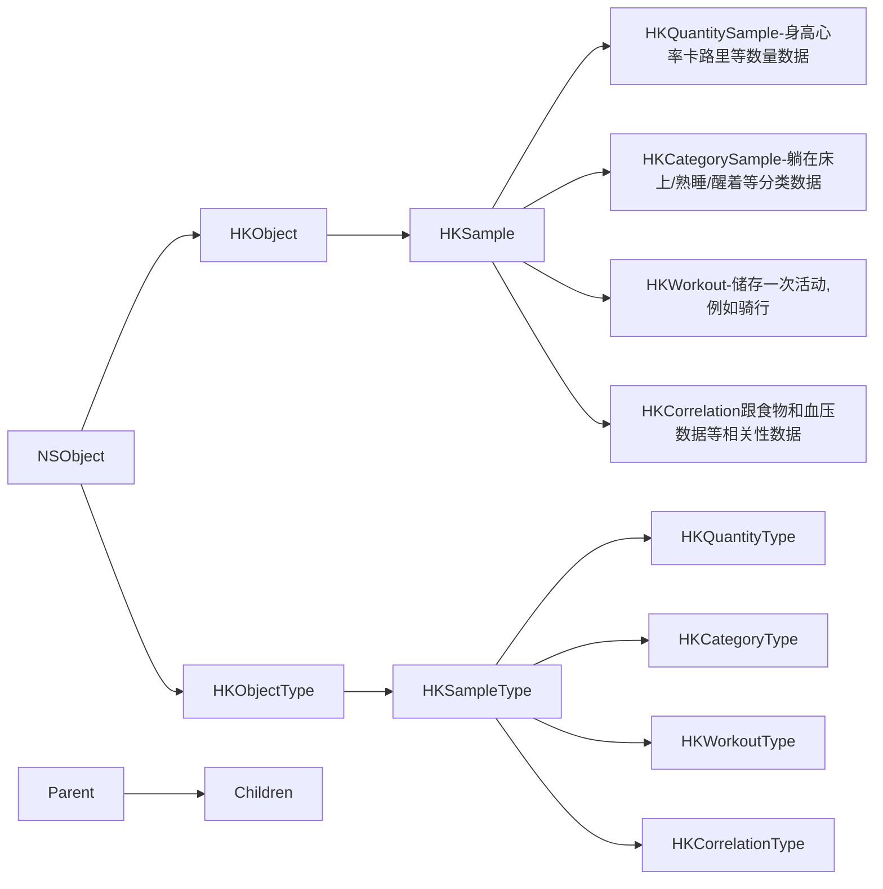
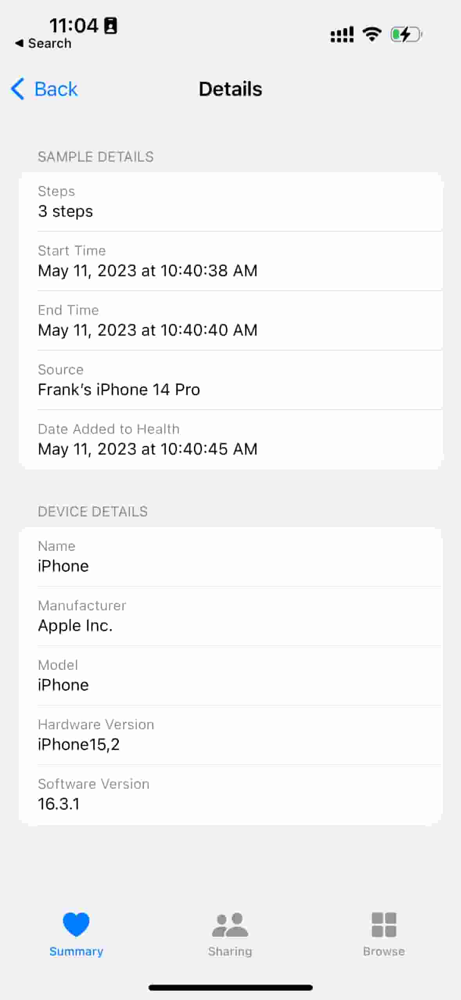

## HealthKit 概览

> [关于 HealthKit 框架](https://developer.apple.com/documentation/healthkit/about_the_healthkit_framework?language=objc)
>
> [Demo App](https://github.com/z3bi/bikelog?ref=iosexample.com)



> [Create and save health and fitness samples.](https://developer.apple.com/documentation/healthkit/samples)

HealthKit Store(HealthKit 商店) :

* Characterstic Data 特征数据：生日，血型等
* Sample Data 样本数据：HKSample 的子类，下方图片详细介绍了关于 Step 的样本
* Workout Data 锻炼数据，HKWorkout
* Source Data 源数据，HKSource 包含保存样本的应用程序，设备信息，例如来自微信，下方图片详细介绍了关于 Step 的源数据
* Deleted objects 删除的对象：HKDeletedObject 临时存储已从 HealthKit存储中删除的项目的 UUID。当用户或其他应用程序删除对象时，您可以使用已删除的对象进行响应。

> [Tell if a Health Kit sample came from an Apple Watch?](https://stackoverflow.com/questions/31110202/tell-if-a-health-kit-sample-came-from-an-apple-watch)




### HKObject 的属性

* UUID
* Metadata: 包含有关条目的其他信息的字典。Metadata 是用于存储有关HealthKit 项目的额外信息的容器。
* Source Revision: 记录每个数据的来源和版本，这样就可以更好地跟踪数据的来源和变化。
* Device: 生成数据的设备

### HKSample 的属性

* Type: 样本类型，如睡眠分析样本、高度样本或步数样本。
* Start date: 开始时间
* End date: 结束时间

### Samples 可以进一步分为四个子类

* HKCategorySample: 躺在床上/熟睡/醒着等分类数据
* HKQuantitySample: 身高心率卡路里等数量数据
* HKCorrelation: 跟食物和血压数据相关
* HKWorkout: 储存一次活动,例如骑行

## HealthKitProvider 类，用于和 HealthKit 交互

> [Demo App](https://github.com/z3bi/bikelog?ref=iosexample.com)

```swift
//
//  HealthKitProvider.swift
//  Bike Log
//
//  Created by Ameir Al-Zoubi on 1/13/22.
//

import Foundation
import HealthKit
import Combine

class HealthKitProvider: HealthProvider {
    
    let store = HKHealthStore()
    let publisher = CurrentValueSubject<HealthResult, Never>(.empty)
    var updateTask: Task<(), Error>?
    
    let healthTypes: Set = [HKWorkoutType.workoutType(),
                            HKQuantityType.quantityType(forIdentifier: .distanceCycling)!,
                            HKQuantityType.quantityType(forIdentifier: .distanceWalkingRunning)!,
                            HKQuantityType.quantityType(forIdentifier: .heartRate)!,
                            HKQuantityType.quantityType(forIdentifier: .activeEnergyBurned)!,
                            HKQuantityType.quantityType(forIdentifier: .basalEnergyBurned)!]
    
    func requestAuthorization() async {
        do {
            try await store.requestAuthorization(toShare: [], read: healthTypes)
        } catch {
            print("Error requesting HealthKit authorization \(error)")
        }
    }

    func queryWorkouts(activity: Activity) {
        updateTask?.cancel()

        let activityPredicate = HKSamplePredicate.workout(HKQuery.predicateForWorkouts(with: activity.hkActivityType))
        let query = HKAnchoredObjectQueryDescriptor(predicates: [activityPredicate], anchor: publisher.value.anchor)
        let updatingResults = query.results(for: store)

        updateTask = Task {
            for try await newResult in updatingResults {
                publishResult(newResult, activity: activity)
            }
        }
    }
    
    private func publishResult(_ result: HKAnchoredObjectQueryDescriptor<HKWorkout>.Result, activity: Activity) {
        let unit = publisher.value.unit
        let newWorkouts = result.addedSamples.compactMap { Workout(hkWorkout: $0, hkUnit: unit.hkUnit()) }
        let deletedIDs = result.deletedObjects.map { $0.uuid }
        let validWorkouts = publisher.value.workouts.filter { !deletedIDs.contains($0.id) }
        let workouts = Array(Set(validWorkouts + newWorkouts))
        
        let newState = HealthResult(workouts: workouts,
                                    unit: publisher.value.unit,
                                    cached: false,
                                    anchor: result.newAnchor)
        publisher.value = newState
        newState.save(for: activity)
    }
    
    func preferredUnit(for type: HKQuantityType) async -> HKUnit {
        do {
            let units = try await store.preferredUnits(for: [type])
            if let unit = units[type] {
                return unit
            }
        } catch {
            print("Error retrieving preferredUnits \(error)")
        }
        
        return Locale.current.distanceUnit().hkUnit()
    }
    
    func monitorWorkouts(activity: Activity) async {
        let cachedResult = try? await HealthResult.load(activity: activity)
        publisher.value = cachedResult ?? .empty

        await requestAuthorization()
        let hkUnit = await preferredUnit(for: HKWorkout.distanceType(for: activity.hkActivityType))
        let unit = hkUnit.lengthUnit()

        if unit != publisher.value.unit {
            let workouts = Workout.updateWorkouts(publisher.value.workouts, unit: unit)
            let updatedResult = HealthResult(workouts: workouts, unit: unit, cached: true, anchor: cachedResult?.anchor)
            publisher.value = updatedResult
        }
        
        queryWorkouts(activity: activity)
    }
    
    func workoutsPublisher() -> AnyPublisher<HealthResult, Never> {
        publisher
            .receive(on: RunLoop.main)
            .eraseToAnyPublisher()
    }
}
```