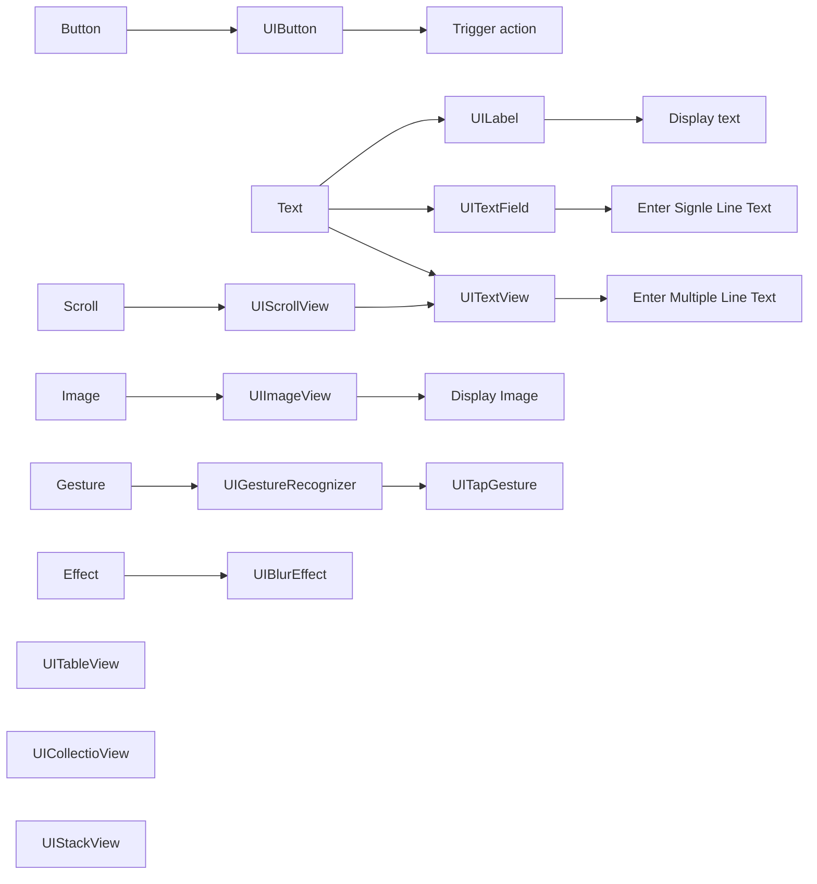
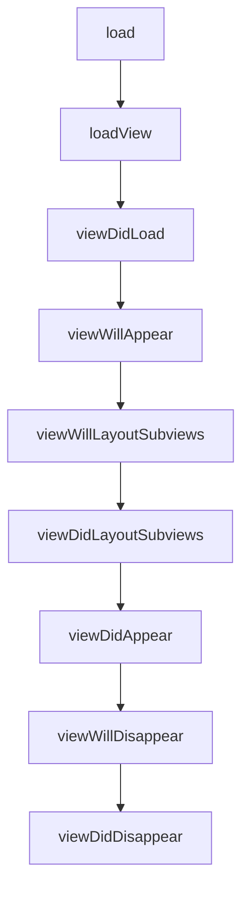
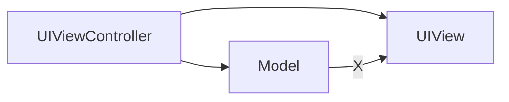

Everything about UIKit in Objective-C & Swift when I was coding. 

> [hws - UIKit Example Code](https://www.hackingwithswift.com/example-code/uikit/)

<!--more-->

## QuickStart

* [Create a UIButton in Code with Objective-C](https://supereasyapps.com/blog/2014/8/4/create-a-uibutton-in-code-with-objective-c)

## Debug Tools

> * [FLEX - Flipboard Explorer](https://github.com/FLEXTool/FLEX)
> * [FLEX 一个轻量级App多维分析工具](https://www.jianshu.com/p/1d8fc9206204)
> * [1.2 万 Star！一个 iOS 应用调试利器](https://zhuanlan.zhihu.com/p/434459667)


```swift
#if os(iOS)
import FLEX
#endif

#if DEBUG
//import FLEX
#endif

#if DEBUG
ToolbarItemGroup {
    Button("Flex") {
        FLEXManager.shared.showExplorer()
    }
//                darkModeButton
}
#endif
```

## Components QuickStart



### Delegate，类扩展

```objc
@interface ViewController ()<UITextFieldDelegate, UITextViewDelegate>

@end
```

() 表示这是一个匿名分类（也叫类扩展或匿名类别），可以在其中添加实例变量和方法。`<UICollectionViewDelegate, UICollectionViewDataSource,UICollectionViewDelegateFlowLayout>` 表示这个类实现了 `UICollectionViewDelegate、UICollectionViewDataSource 和 UICollectionViewDelegateFlowLayout` 这三个协议。在 Objective-C 中，需要在类的声明中明确列出所实现的协议，这有助于编译器检查类是否实现了协议中规定的所有方法。

```objc
@interface TestingUICollectionViewCell ()<UICollectionViewDelegate, UICollectionViewDataSource,UICollectionViewDelegateFlowLayout>
@end
```

```swift
class TestingUICollectionViewCell: UICollectionViewCell, UICollectionViewDelegate, UICollectionViewDataSource, UICollectionViewDelegateFlowLayout {
    // class implementation goes here
}
```

### Button
<!-- markdownlint-disable MD010 -->
```objc
// in file ViewController.m
- (void)viewDidLoad {
    [super viewDidLoad];

    UIButton *button = [UIButton buttonWithType:
									UIButtonTypeSystem];
    [button setTitle:@"Press Me" forState:UIControlStateNormal];
    [button sizeToFit];

	// Set a new (x,y) point for the button's center
    button.center = CGPointMake(320 / 2, 60);

	// Add an action in current code file (i.e. target)
    [button addTarget:self 
			action:@selector(buttonPressed:）
			forControlEvents:UIControlEventTouchUpInside];

    [self.view addSubview:button];
} 

- (void)buttonPressed:(UIButton *)button {
     NSLog(@"Button Pressed");
}

// Another Button
- (void)viewDidLoad {
    [super viewDidLoad];

    UIButton *button = [[UIButton alloc] initWithFrame:CGRectMake(100, 100, 200, 200)];
    [button setTitle:@"hello" forState:UIControlStateNormal];
    [button addTarget:self action:@selector(buttonPressed) forControlEvents:UIControlEventTouchUpInside];
    [self.view addSubview:button];
}

- (void)buttonPressed {
    NSLog(@"Hello world");
}
```

### UILabel & UITextField & UITextView

```objc
//
//  ViewController.m
//  DouyinObjc
//
//  Created by Chu Yong on 5/13/23.
//

#import "ViewController.h"

@interface ViewController ()<UITextFieldDelegate, UITextViewDelegate>

@end

@implementation ViewController

- (void)viewDidLoad {
    [super viewDidLoad];
    self.view.backgroundColor = [UIColor redColor];
    UILabel *label = [[UILabel alloc] initWithFrame:CGRectMake(100, 100, 100, 100)];
    label.text = @"Hello World";
    label.backgroundColor = [UIColor whiteColor];
    [self.view addSubview:label];
    
    // TextFields
    UITextField *textfield = [[UITextField alloc] initWithFrame:CGRectMake(0, 200, UIScreen.mainScreen.bounds.size.width, 200)];
    textfield.text = @"Hello";
    textfield.placeholder = @"Enter something";
    textfield.delegate = self;
    [self.view addSubview:textfield];
    
    // TextView
    UITextView *textView = [[UITextView alloc] initWithFrame:CGRectMake(0, 400, UIScreen.mainScreen.bounds.size.width, 200)];
    textView.text = @"Hello";
    textView.backgroundColor = [UIColor yellowColor];
    textView.delegate = self;
    [self.view addSubview:textView];
}

- (BOOL)textView:(UITextView *)textView shouldChangeTextInRange:(NSRange)range replacementText:(NSString *)text {
    if ([text isEqualToString:@"\n"]) {
        [textView resignFirstResponder];
    }
    return YES;
}

- (BOOL)textFieldShouldReturn:(UITextField *)textField {
    [textField resignFirstResponder];
    return YES;
}

- (void)textFieldDidBeginEditing:(UITextField *)textField {
    NSLog(@"%@", textField.text);
}
@end
```

### UIImage

```objc
// UIImage
UIImage *image = [UIImage systemImageNamed:@"plus"];
UIImageView *imageView = [[UIImageView alloc] initWithImage:image];
imageView.frame = CGRectMake(50, 50, 20, 200);
imageView.contentMode = UIViewContentModeScaleAspectFill;
imageView.layer.borderWidth = 1.0;
imageView.layer.borderColor = [UIColor yellowColor].CGColor;
[self.view addSubview:imageView];
```

### UITableView & UICollectionView

UITableView 和 UICollectionView 是 iOS 中常用的两种列表控件。

UITableView 是一个列表控件，可以用来展示单行或多行数据。它是基于 Model-View-Controller 设计模式的。UITableView 中的每个 cell 都可以由一个 UITableViewCell 类型的实例表示，而这个实例通常包含了一些 UI 元素和一些用来展示数据的控件。UITableView 中可以设置 section 来分组显示数据。

UICollectionView 是一个强大的集合控件，可以用来展示多行、多列的数据。它也是基于 Model-View-Controller 设计模式的。与 UITableView 不同，UICollectionView 的布局方式更加灵活，可以通过设置 layout 来控制每个 cell 的大小、位置、对齐方式等等。与 UITableView 相似，UICollectionView 也可以使用 section 来分组显示数据，而且它还支持一些特殊的布局方式，如流式布局等。

总的来说，UITableView 适用于简单的列表展示，而UICollectionView 则更加适用于展示多样化、样式复杂的数据，同时它的布局方式更加灵活。

```objc
//
//  ViewController.m
//  DouyinObjc
//
//  Created by Chu Yong on 5/13/23.
//

#import "ViewController.h"

@interface ViewController ()<UICollectionViewDelegate, UICollectionViewDataSource>
@property (nonatomic, strong) NSMutableArray <NSArray *>*sections;
@end

@implementation ViewController

- (void)viewDidLoad {
    [super viewDidLoad];
    
    // UICollectionView
    self.sections = [NSMutableArray array];
    [self.sections addObject:@[@"123"]];
    [self.sections addObject:@[@"3", @"4"]];
    [self.sections addObject:@[@"3", @"4", @"3", @"4"]];

    UICollectionViewFlowLayout *layout = [[UICollectionViewFlowLayout alloc] init];
    UICollectionView *collectionView = [[UICollectionView alloc] initWithFrame:self.view.bounds collectionViewLayout:layout];
    
    layout.itemSize = CGSizeMake(100, 200);
    layout.minimumLineSpacing = 20;
    layout.sectionInset = UIEdgeInsetsMake(0, 0, 50, 0);
    [collectionView registerClass:[UICollectionViewCell class] forCellWithReuseIdentifier:@"cell"];
    
    collectionView.delegate = self;
    collectionView.dataSource = self;
    
    [self.view addSubview:collectionView];
}

- (NSInteger)numberOfSectionsInCollectionView:(UICollectionView *)collectionView {
    return self.sections.count;
}

- (NSInteger)collectionView:(UICollectionView *)collectionView numberOfItemsInSection:(NSInteger)section {
    return self.sections[section].count;
}

- (__kindof UICollectionViewCell *)collectionView:(UICollectionView *)collectionView cellForItemAtIndexPath:(NSIndexPath *)indexPath {
    UICollectionViewCell *cell = [collectionView dequeueReusableCellWithReuseIdentifier:@"cell" forIndexPath:indexPath];
    
    UILabel *label = [[UILabel alloc] initWithFrame:CGRectMake(10, 10, 50, 50)];
    label.text = self.sections[indexPath.section][indexPath.row];
    [cell addSubview:label];
    
    cell.backgroundColor = [UIColor redColor];
    return cell;
}
@end
```

### Protocol & UICollectionView

* [[OC] UIcollectionView and UIcollectionViewCell](https://www.cnblogs.com/OranBlog/p/9208782.html)
* [[Swift] UICollectionView data source and delegates](https://xuebaonline.com/UICollectionView%20data%20source%20and%20delegates/)
* [纯代码创建UICollectionView步骤以及简单使用](https://www.jianshu.com/p/16c9d466f88c)

```objc
// ViewController.h
// <> Means Controller conform delegate inside <>
@interface ViewController : UIViewController <UICollectionViewDelegate, UICollectionViewDataSource>
@end
```

```objc
@interface ViewController ()
@property (nonatomic, strong) UICollectionView *collectionView;
@end
```

> [collectionView:cellForItemAtIndexPath:](https://developer.apple.com/documentation/uikit/uicollectionviewdatasource/1618029-collectionview?language=objc)
>
> Asks your data source object for the cell that corresponds to the specified item in the collection view.

```objc
@implementation ViewController
- (void)viewDidLoad {
	[super viewDidLoad];
	[self loadCollectioView];
}

- (void)loadCollectioView {
    // Layout Init
    // let layout = UICollectionViewFlowLayout()
    UICollectionViewFlowLayout *flowlayout = [[UICollectionViewFlowLayout alloc] init];
    
    // self.collectionView = UICollectionView(frame: .zero, collectionViewLayout: layout)
    _collectionView = [[UICollectionView alloc]initWithFrame:self.view.frame collectionViewLayout:flowlayout];
    
    // Cell Size
    flowlayout.itemSize = CGSizeMake(280, 280);
    
    // head Size
    flowlayout.headerReferenceSize = CGSizeMake(self.view.frame.size.width, 40);
    
    // Cell vertical spacing
    flowlayout.minimumLineSpacing = 10;
    
    // Cell horizontal spacing
    flowlayout.minimumInteritemSpacing = 20;
    
    // Cell to container edge
    flowlayout.sectionInset = UIEdgeInsetsMake(20, 20, 20, 20); // Up left down right
    
    // collectionView init
    
    // Register Cell !! IMPORTANT
    // collectionView.register(UICollectionViewCell.self, forCellWithReuseIdentifier: "cell")
    [_collectionView registerClass:[UICollectionViewCell class] forCellWithReuseIdentifier:@"cell"];
    
    // Set delegate
    // collectionView.dataSource = self
    // collectionView.delegate = self
    _collectionView.dataSource = self;
    _collectionView.delegate = self;
    
    // Background color
    _collectionView.backgroundColor = [UIColor greenColor];
    
    // Felxible Width & Height
    _collectionView.autoresizingMask = UIViewAutoresizingFlexibleWidth | UIViewAutoresizingFlexibleHeight;
    
    // Add View
    [self.view addSubview:_collectionView];
    
    // Size settings
    [_collectionView setFrame:self.view.frame];
}

- (__kindof UICollectionViewCell *)collectionView:(UICollectionView *)collectionView cellForItemAtIndexPath:(NSIndexPath *)indexPath {
    
    // Cell Reuse, identifier is same as the registration(@"cell")
    // let cell = collectionView.dequeueReusableCell(withReuseIdentifier: "cell", for: indexPath)
    UICollectionViewCell *cell = [collectionView dequeueReusableCellWithReuseIdentifier:@"cell" forIndexPath:indexPath];

    // Optional
    if (!cell) {
        cell = [[UICollectionViewCell alloc] init];
//        [cell.contentView setBackgroundColor:[UIColor systemBlueColor]];
    }
    // cell.contentView.backgroundColor = .systemBlue
    [cell.contentView setBackgroundColor:[UIColor systemBlueColor]];
    return cell;
}

- (NSInteger)collectionView:(UICollectionView *)collectionView numberOfItemsInSection:(NSInteger)section {
    return 120;
}
@end
```

```swift
import UIKit

class ViewController: UIViewController {
    
    var collectionView: UICollectionView!

    override func viewDidLoad() {
        super.viewDidLoad()
        // Do any additional setup after loading the view, typically from a nib.
        self.view.backgroundColor = .green
        
        let flowLayout = UICollectionViewFlowLayout()
        self.collectionView = UICollectionView(frame: self.view.safeAreaLayoutGuide.layoutFrame, collectionViewLayout: flowLayout)
        
        flowLayout.scrollDirection = .horizontal
        flowLayout.itemSize = CGSizeMake(180, 180)
        
        collectionView.delegate = self
        collectionView.dataSource = self
        
        collectionView.register(ExampleCell.self, forCellWithReuseIdentifier: String(describing: type(of: ExampleCell.self)))
        
        self.view.addSubview(collectionView)
    }

    override func didReceiveMemoryWarning() {
        super.didReceiveMemoryWarning()
        // Dispose of any resources that can be recreated.
    }
}

extension ViewController: UICollectionViewDataSource {
    func collectionView(_ collectionView: UICollectionView, cellForItemAt indexPath: IndexPath) -> UICollectionViewCell {
        let cell = collectionView.dequeueReusableCell(withReuseIdentifier: String(describing: type(of: ExampleCell.self)), for: indexPath) as! ExampleCell
        cell.titleLabel.text = String(indexPath.row)
        return cell
    }
    
    func numberOfSections(in collectionView: UICollectionView) -> Int {
        1
    }
    
    func collectionView(_ collectionView: UICollectionView, numberOfItemsInSection section: Int) -> Int {
        10
    }
}

extension ViewController: UICollectionViewDelegate {
    func collectionView(_ collectionView: UICollectionView, didSelectItemAt indexPath: IndexPath) {
        print("Selected item at index: \(indexPath.row)")
    }
}

class ExampleCell: UICollectionViewCell {
    let titleLabel = UILabel()
    
    override init(frame: CGRect) {
        super.init(frame: frame)
        
        self.initUI()
    }
    
    required init?(coder: NSCoder) {
        fatalError("init(coder:) has not been implemented")
    }
    
    private func initUI() {
        self.backgroundColor = .red
        
        // Text for index
        titleLabel.frame = CGRect(x: 50, y: 50, width: 50, height: 20)
        self.addSubview(titleLabel)
    }
}
```

## No Storyboard

* [Day-11 使用UIKit框架建立iOS App專案(不使用storyboard)](https://ithelp.ithome.com.tw/articles/10298398)
* [抖音OC实战教程-前言（01）](https://www.bilibili.com/video/BV1xo4y1L72u)

```swift
guard let windowScene = (scene as? UIWindowScene) else { return }
window = UIWindow(frame: windowScene.coordinateSpace.bounds)
window?.windowScene = windowScene
window?.rootViewController = ViewController()
window?.makeKeyAndVisible()
```

这段代码是使用 Objective-C 编写的。在 Objective-C 中，我们需要显式地进行类型转换，并使用方括号表示方法调用和消息发送的语法。同样，也需要手动创建 UIWindow 对象，并将其设置为应用程序的主窗口。注意，ViewController 是你应用程序中的视图控制器类的名称，你需要根据实际情况进行替换。

```objc
UIWindowScene *windowScene = (UIWindowScene *)scene;
if (![windowScene isKindOfClass:[UIWindowScene class]]) {
    return;
}
self.window = [[UIWindow alloc] initWithFrame:windowScene.coordinateSpace.bounds];
self.window.windowScene = windowScene;
self.window.rootViewController = [[ViewController alloc] init];
[self.window makeKeyAndVisible];
```
* [Day-11 使用UIKit框架建立iOS App專案(不使用storyboard)](https://ithelp.ithome.com.tw/articles/10298398)
* [抖音OC实战教程-前言（01）](https://www.bilibili.com/video/BV1xo4y1L72u)

```swift
guard let windowScene = (scene as? UIWindowScene) else { return }
window = UIWindow(frame: windowScene.coordinateSpace.bounds)
window?.windowScene = windowScene
window?.rootViewController = ViewController()
window?.makeKeyAndVisible()
```

这段代码是使用 Objective-C 编写的。在 Objective-C 中，我们需要显式地进行类型转换，并使用方括号表示方法调用和消息发送的语法。同样，也需要手动创建 UIWindow 对象，并将其设置为应用程序的主窗口。注意，ViewController 是你应用程序中的视图控制器类的名称，你需要根据实际情况进行替换。

```objc
UIWindowScene *windowScene = (UIWindowScene *)scene;
if (![windowScene isKindOfClass:[UIWindowScene class]]) {
    return;
}
self.window = [[UIWindow alloc] initWithFrame:windowScene.coordinateSpace.bounds];
self.window.windowScene = windowScene;
self.window.rootViewController = [[ViewController alloc] init];
[self.window makeKeyAndVisible];
```

## Loading Method of AppDelegate, SceneDelegate and Controller AppDelegate、SceneDelegate、控制器的加载方式

* [AppDelegate, SceneDelegate, Controller](https://blog.csdn.net/weixin_46926959/article/details/120076013)

> iOS13 之前，AppDelegate的职责是：全权处理App生命周期和UI生命周期
>
> Before iOS13, the AppDelegate is responsible for handling the entire App lifecycle and the UI lifecycle.
>
> iOS 13 之后，AppDelegate的职责是：处理App生命周期和SceneDelegate 生命周期
>
> After iOS 13, the AppDelegate is responsible for handling the App lifecycle and the SceneDelegate lifecycle.
>

### StartUp Process 启动过程

main函数 -> 自动释放池 -> UIApplicationMain（永不返回，保证程序不会被销毁）-> 创建应用程序对象UIApplication ->创建应用程序的代理对象AppDelegate -> IOS13之前，将AppDelegate的window实例化，设置为keyWindow主窗口 -> 加载配置文件指定的storyboard

main function -> autorelease pool -> UIApplicationMain (never returns, to ensure that the program will not be destroyed) -> create the application object UIApplication -> create the application delegate object AppDelegate -> IOS13 before, instantiate the AppDelegate's window, set it as the keyWindow main window -> load the storyboard specified in the configuration file

## UIKit UIViewController Lifecycle



```objc
//
//  ViewController.m
//  DouyinObjc
//
//  Created by Chu Yong on 5/13/23.
//

#import "ViewController.h"

@interface ViewController ()

@end

@implementation ViewController

+ (void)load {
    [super load];
    NSLog(@"1");
}

- (void)loadView {
    [super loadView];
    NSLog(@"2");
}

- (void)viewDidLoad {
    [super viewDidLoad];
    // Do any additional setup after loading the view.
    NSLog(@"3");
    
    self.view.backgroundColor = [UIColor redColor];
}

- (void)viewWillAppear:(BOOL)animated {
    [super viewWillAppear:animated];
    NSLog(@"4");
}

- (void)viewWillLayoutSubviews {
    [super viewWillLayoutSubviews];
    NSLog(@"5");
}

- (void)viewDidLayoutSubviews {
    [super viewDidLayoutSubviews];
    NSLog(@"6");
}

- (void)viewDidAppear:(BOOL)animated {
    [super viewDidAppear:animated];
    NSLog(@"7");
}

- (void)viewWillDisappear:(BOOL)animated {
    [super viewWillDisappear:animated];
    NSLog(@"8");
}

- (void)viewDidDisappear:(BOOL)animated {
    [super viewDidDisappear:animated];
    NSLog(@"9");
}

- (void)dealloc {
    NSLog(@"10");
}

@end
```

## MVC



```objc
- (void)viewDidLoad {
    [super viewDidLoad];
    self.view.backgroundColor = [UIColor redColor];
    UILabel *label = [[UILabel alloc] initWithFrame:CGRectMake(100, 100, 100, 100)];
    label.text = @"Hello World";
    [self.view addSubview:label];
}
```

## Target for Project in Xcode

* [How to Properly Remove Main.Storyboard (for iOS 13+)](https://ioscoachfrank.com/remove-main-storyboard.html)

```xml
<!-- Info.plist -->
<?xml version="1.0" encoding="UTF-8"?>
<!DOCTYPE plist PUBLIC "-//Apple//DTD PLIST 1.0//EN" "http://www.apple.com/DTDs/PropertyList-1.0.dtd">
<plist version="1.0">
<dict>
	<key>UIApplicationSceneManifest</key>
	<dict>
		<key>UIApplicationSupportsMultipleScenes</key>
		<false/>
		<key>UISceneConfigurations</key>
		<dict>
			<key>UIWindowSceneSessionRoleApplication</key>
			<array>
				<dict>
					<key>UISceneConfigurationName</key>
					<string>Default Configuration</string>
					<key>UISceneDelegateClassName</key>
					<string>SceneDelegate</string>
				</dict>
			</array>
		</dict>
	</dict>
</dict>
</plist>

<key>Storyboard Name</key>
```

## Delegate

* [Delegate Pattern In Swift](https://medium.com/@armanabkar/delegate-pattern-in-ios-a26f2b329097)
* [The Holy Grail of UIKit: Delegate Pattern](https://tarikdahic.com/posts/the-holy-grail-of-uikit-delegate-pattern/)
* [UIKit in SwiftUI](https://zhuanlan.zhihu.com/p/402897951)

## SwiftUI In UIKit(Objective-C)

* [Using SwiftUI in Objective-C](https://www.jianshu.com/p/549facb59caf)

```swift
import SwiftUI
struct MainViewInterface: View {
     var body: some View {
          Text("Hello, World!")
   }
}

@objc
class MainView: NSObject {
    @objc func makeMainView() -> UIViewController {
        return UIHostingController(rootView:  MainViewInterface())
    }
}
```

```objc
// #import "<projectName>-Swift.h"
// Lookup in Targets - Build Settings - Search for Swift - Objective-C Generated Interface Header Name
#import "testSwift-Swift.h" 

@implementation ViewController

- (void)viewDidLoad {
	[super viewDidLoad];

	UIViewController *vc = [[MainView new] makeMainView];
	vc.view.frame = CGRectMake(100, 400, 200, 100);
	[self.view addSubview:vc.view];
}

@end
```

> [Display SwiftUI views from Objective-C codebase](https://tarikdahic.com/posts/display-swiftui-views-from-objective-c-codebase/)

```swift
@objc class HelloWorldViewFactory: NSObject {
    
    @objc static func create(text: String) -> UIViewController {
        let helloWorldView = HelloWorldView(text: text)
        let hostingController = UIHostingController(rootView: helloWorldView)
        
        return hostingController
    }
}
```

```objc
UIViewController *vc = [HelloWorldViewFactory createWithText:@"Hello from Obj-C!"];
[self presentViewController:vc animated:YES completion:nil];
```

> [Presenting SwiftUI Views from ObjectiveC](https://levelup.gitconnected.com/presenting-swiftui-views-from-objectivec-12f49f88716e)

```swift
import Foundation
import SwiftUI

class SwiftUIViewFactory: NSObject {
  @objc static func makeSwiftUIView(dismissHandler: @escaping (() -> Void)) -> UIViewController {
    return UIHostingController(rootView: SwiftUIView(dismiss: dismissHandler))
  }
}
```

```objc
- (IBAction)showSwiftUIView:(id)sender {
  UIViewController *vc = [SwiftUIViewFactory makeSwiftUIViewWithDismissHandler:^{
    [[self presentedViewController] dismissViewControllerAnimated:YES completion:nil];
  }];
  [self presentViewController:vc animated:YES completion:nil];
}
```

### Full Code

```objc
UIButton *btn = [UIButton buttonWithType:UIButtonTypeSystem];
[btn setTitle:@"HI" forState:UIControlStateNormal];
[btn addTarget:self action:@selector(buttonClicked) forControlEvents:UIControlEventTouchUpInside];
btn.frame = CGRectMake(100, 100, 200, 50);
[self.view addSubview:btn];

- (void)buttonClicked {
    UIViewController* vc = [SwiftUIViewFactory makeSwiftUIViewWithDismissHandler:^{
        [[self presentedViewController] dismissViewControllerAnimated:YES completion:nil];
    }];
    [self presentViewController:vc animated:YES completion:nil];
}
```

```swift
class SwiftUIViewFactory: NSObject {
    @objc static func makeSwiftUIView(dismissHandler: @escaping (() -> Void)) -> UIViewController {
        return UIHostingController(rootView: ContentView(dismiss: dismissHandler))
    }
}
```

> [Presenting SwiftUI Views from ObjectiveC](https://levelup.gitconnected.com/presenting-swiftui-views-from-objectivec-12f49f88716e)

> [Display SwiftUI views from Objective-C codebase](https://tarikdahic.com/posts/display-swiftui-views-from-objective-c-codebase/)

```swift
@objc class HelloWorldViewFactory: NSObject {
    
    @objc static func create(text: String) -> UIViewController {
        let helloWorldView = HelloWorldView(text: text)
        let hostingController = UIHostingController(rootView: helloWorldView)
        
        return hostingController
    }
}
```

```objc
UIViewController *vc = [HelloWorldViewFactory createWithText:@"Hello from Obj-C!"];
[self presentViewController:vc animated:YES completion:nil];
```

> [Presenting SwiftUI Views from ObjectiveC](https://levelup.gitconnected.com/presenting-swiftui-views-from-objectivec-12f49f88716e)

```swift
import Foundation
import SwiftUI

class SwiftUIViewFactory: NSObject {
  @objc static func makeSwiftUIView(dismissHandler: @escaping (() -> Void)) -> UIViewController {
    return UIHostingController(rootView: SwiftUIView(dismiss: dismissHandler))
  }
}
```

```objc
- (IBAction)showSwiftUIView:(id)sender {
  UIViewController *vc = [SwiftUIViewFactory makeSwiftUIViewWithDismissHandler:^{
    [[self presentedViewController] dismissViewControllerAnimated:YES completion:nil];
  }];
  [self presentViewController:vc animated:YES completion:nil];
}
```

### Full Code

```objc
UIButton *btn = [UIButton buttonWithType:UIButtonTypeSystem];
[btn setTitle:@"HI" forState:UIControlStateNormal];
[btn addTarget:self action:@selector(buttonClicked) forControlEvents:UIControlEventTouchUpInside];
btn.frame = CGRectMake(100, 100, 200, 50);
[self.view addSubview:btn];

- (void)buttonClicked {
    UIViewController* vc = [SwiftUIViewFactory makeSwiftUIViewWithDismissHandler:^{
        [[self presentedViewController] dismissViewControllerAnimated:YES completion:nil];
    }];
    [self presentViewController:vc animated:YES completion:nil];
}
```

```swift
class SwiftUIViewFactory: NSObject {
    @objc static func makeSwiftUIView(dismissHandler: @escaping (() -> Void)) -> UIViewController {
        return UIHostingController(rootView: ContentView(dismiss: dismissHandler))
    }
}
```

> [Presenting SwiftUI Views from ObjectiveC](https://levelup.gitconnected.com/presenting-swiftui-views-from-objectivec-12f49f88716e)

## Lazy Instantiation

> See more in [objc-snippet](../objc-snippet#lazy-instantiation)

## Border

> [kingfisher - onevcat on twitter](https://twitter.com/onevcat/status/1600020125746311168?s=20)

```objc
@interface ViewController ()
@property (weak, nonatomic) IBOutlet UIImageView *imageView;
@property (weak, nonatomic) IBOutlet UIImageView *secondImgView;

@end

@implementation ViewController

- (void)viewDidLoad {
    [super viewDidLoad];
    // Do any additional setup after loading the view.
    self.imageView.layer.cornerRadius = self.imageView.frame.size.width / 2;
    self.imageView.layer.masksToBounds = true;
    self.imageView.layer.borderWidth = 2.0;
    self.imageView.layer.borderColor = [UIColor whiteColor].CGColor;
    self.secondImgView.layer.cornerRadius = self.imageView.frame.size.width / 2;
    self.secondImgView.layer.borderWidth = 2.0;
    self.secondImgView.layer.borderColor = [UIColor whiteColor].CGColor;
}

@end
```

```swift
import SwiftUI
struct ContentView: View {
    
    var body: some View {
        HStack {
            ForEach(0..<3, id: \.self) { i in
                Image("icon")
                    .resizable()
                    .frame(width: 100, height: 100)
                    .overlay {
                        Circle()
                            .stroke(.blue, lineWidth: 5)
                    }
                //.cornerRadius(50)
                    .offset(x: CGFloat(-i * 50), y: 0)
            }
        }
    }
    
}
```

在 SwiftUI 中，视图的修改器是一种声明式方法，用于描述视图的外观和行为。在这种情况下，为了实现与 UIKit 类似的效果，我们需要将边框绘制为一个圆形视图的叠加层。

SwiftUI 与 UIKit 的设计理念有很大差异。在 UIKit 中，我们直接操作视图的层（layer）来实现边框、圆角等效果。而在 SwiftUI 中，我们通过组合和修改视图来实现所需的效果。这种声明式的方式允许 SwiftUI 更好地优化渲染过程，并提供更易读、更易维护的代码。

在上面的 SwiftUI 示例中，我们使用了 overlay 修改器来添加一个描边圆形，从而实现了类似于 UIKit 中的边框效果。虽然这种方法与 UIKit 的操作方式不同，但它非常符合 SwiftUI 的设计原则，并能很好地满足需求。

## ResponsiveScaleWidth

```objc
#define ResponsiveScaleWidth(length) (((length)/375.0f) * [[UIScreen mainScreen] bounds].size.width)
```

## UIKit Preview

> [UIKit Preview](https://ruipfcosta.github.io/UIKitPreviewsGenerator-Website/index.html)

<!-- markdownlint-disable MD033 -->
<video style="max-width: 100%;box-shadow: rgba(50, 50, 93, 0.25) 0px 50px 100px -20px, rgba(0, 0, 0, 1) 0px 30px 60px -30px;" loop muted autoplay playsinline>
    <source src="https://ruipfcosta.github.io/UIKitPreviewsGenerator-Website/assets/video/demo.mov">
</video>

```swift
import UIKit

class ViewController: UINavigationController {

    override func viewDidLoad() {
        super.viewDidLoad()
        // Do any additional setup after loading the view.
        var text = UILabel(frame: CGRect(x: 20, y: 20, width: 300, height: 300))
        text.text = "UIKit Preview Testing"
        self.view.addSubview(text)
    }
}

#if DEBUG

import SwiftUI

struct ViewControllerRepresentable: UIViewControllerRepresentable {
    typealias UIViewControllerType = ViewController

    func makeUIViewController(context: Context) -> UIViewControllerType {
        ViewController()
    }
    
    func updateUIViewController(_ uiViewController: UIViewControllerType, context: Context) {
        
    }
}

struct ViewController_Previews: PreviewProvider {
    static var previews: some View {
        ViewControllerRepresentable()
    }
}
```

## IBAction

```objc
- (IBAction)showSwiftUIView:(id)sender {}
```

这段代码中的圈表示了方法的返回类型。在 Objective-C 中，方法的返回类型用圆括号括起来，并位于方法名称之前。在这种情况下，(IBAction) 表示该方法返回一个特殊的类型，用于在 Interface Builder 中与用户界面的操作进行关联。

IBAction 是 Objective-C 中特有的关键字，用于表示该方法可以与用户界面的事件进行连接。在 Interface Builder 中，你可以将按钮、手势等与该方法关联起来，以在用户交互时触发该方法的执行。

需要注意的是，IBAction 实际上只是一个宏定义，它将被转换为 void 类型，因此在 Swift 中不需要显示地指定返回类型。在 Swift 中，你可以将方法定义为 @IBAction，并省略返回类型的圆括号。例如，在 Swift 中定义一个类似的方法会更简洁：

```swift
@IBAction func showSwiftUIView(_ sender: Any) {
    // 方法的具体实现
}
```

## `prepareForSegue`

```objc
#pragma mark - Navigation

// In a storyboard-based application, you will often want to do a little preparation before navigation
- (void)prepareForSegue:(UIStoryboardSegue *)segue sender:(id)sender {
    // Get the new view controller using [segue destinationViewController].
    // Pass the selected object to the new view controller.
}
```

`prepareForSegue:sender:` 方法是在使用基于Storyboard的应用程序中进行页面跳转前的准备工作的常用方法。当一个Segue（故事板中的跳转）被触发时，系统会自动调用该方法。

在这个方法中，你可以通过 `[segue destinationViewController]` 获取目标视图控制器，然后根据需要进行一些准备工作。例如，你可以将数据传递给目标视图控制器，设置目标视图控制器的属性，或执行其他必要的操作。

通常，你可以根据Segue的标识符（identifier）来区分不同的跳转，并根据需要进行相应的准备工作。例如：

```objc
- (void)prepareForSegue:(UIStoryboardSegue *)segue sender:(id)sender {
    if ([segue.identifier isEqualToString:@"MySegueIdentifier"]) {
        // 获取目标视图控制器
        MyViewController *destinationViewController = [segue destinationViewController];
        
        // 进行一些准备工作，例如传递数据或设置属性
        destinationViewController.myProperty = myData;
    }
}
```

通过在 prepareForSegue:sender: 方法中进行准备工作，你可以确保在进行页面跳转之前，目标视图控制器已经准备好接收数据或执行其他操作，以便在跳转后呈现所需的结果。

## 头文件 import

在 Objective-C 中，#import 是用于导入头文件的预处理指令。它有两种形式：#import <Framework/Module.h> 和 #import "LocalFile.h"。

#import <Framework/Module.h>：这种形式用于导入系统框架或第三方库的头文件。<Framework/Module.h> 是一个相对于系统或第三方库的头文件路径。这种方式通常用于导入公共框架或库的头文件。例如：

```objc
#import <UIKit/UIKit.h>
#import <AFNetworking/AFNetworking.h>
```

#import "LocalFile.h"：这种形式用于导入项目中的自定义头文件或本地文件的头文件。"LocalFile.h" 是一个相对于当前文件的头文件路径。这种方式通常用于导入自定义的类或其他文件的头文件。例如：

```objc
#import "MyCustomClass.h"
#import "Constants.h"
```

总的来说，#import <Framework/Module.h> 用于导入系统框架或第三方库的头文件，而 #import "LocalFile.h" 用于导入项目中的自定义头文件或本地文件的头文件。

需要注意的是，无论使用哪种形式，#import 指令都会在编译时将指定的头文件内容复制到当前文件中，以便在编译过程中能够访问导入的类、函数、常量等内容。